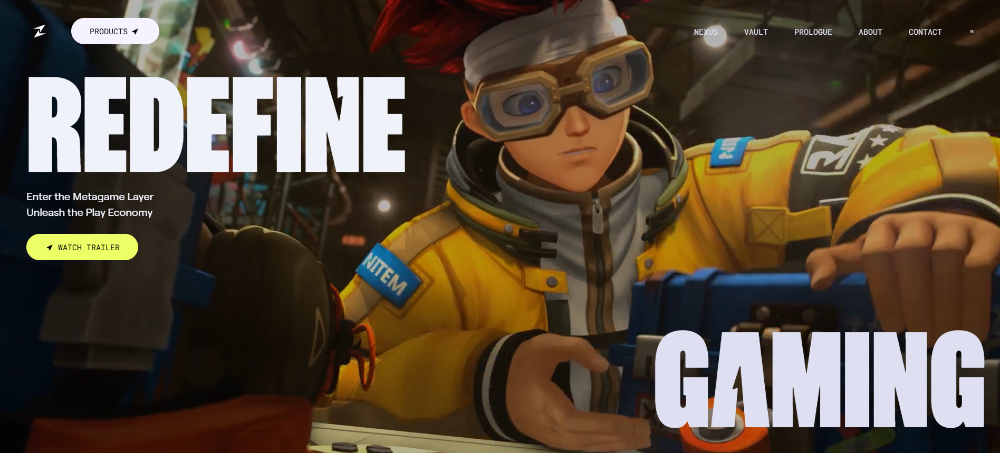

# 🎮 Zentry Game Website

A modern, interactive gaming landing page inspired by **Zentry**, built with **React**, **Vite**, **Tailwind CSS**, and **GSAP**. This project focuses on delivering a premium user experience through smooth animations, immersive visuals, and responsive design.

## ✨ Features

- 🎨 Modern gaming-inspired UI
- ⚡ Smooth GSAP-powered animations
- 📱 Fully responsive across devices
- 🎯 Interactive scroll and hover effects
- 🚀 Fast development with Vite
- 🎭 Clean, reusable React components
- 🌈 Tailwind CSS utility-first styling
- 📦 Optimized production build

## 🛠️ Tech Stack

- **React**
- **Vite**
- **Tailwind CSS**
- **GSAP (GreenSock Animation Platform)**
- **JavaScript (ES6+)**

---

## 📂 Project Structure

```text
zentry-game-website/
│
├── public/              # Static assets
├── src/
│   ├── components/      # Reusable UI components
│   ├── assets/          # Images, videos, icons
│   ├── styles/          # Global styles
│   ├── App.jsx
│   └── main.jsx
│
├── package.json
├── vite.config.js
└── README.md
```

---

## 🚀 Getting Started

### Prerequisites

Make sure you have installed:

- Node.js (v18 or later)
- npm or yarn

### Installation

Clone the repository:

```bash
git clone https://github.com/sajansinghthakuri/zentry-game-website.git

cd zentry-game-website
```

Install dependencies:

```bash
npm install
```

Start the development server:

```bash
npm run dev
```

Open your browser and visit:

```
http://localhost:5173
```

---

## 📦 Build for Production

```bash
npm run build
```

Preview the production build:

```bash
npm run preview
```

---

## 🎯 Learning Goals

This project was created to practice and improve skills in:

- Advanced React component architecture
- GSAP timeline and scroll animations
- Responsive UI development
- Modern frontend workflows using Vite
- Tailwind CSS utility-based styling

---

## 📸 Screenshots



````markdown
---

## 🤝 Contributing

Contributions are welcome!

1. Fork the repository
2. Create a feature branch

```bash
git checkout -b feature/amazing-feature
```
````

3. Commit your changes

```bash
git commit -m "Add amazing feature"
```

4. Push the branch

```bash
git push origin feature/amazing-feature
```

5. Open a Pull Request

---

## 📄 License

This project is licensed under the MIT License.

---

## 👨‍💻 Author

**Sajan Singh Thakuri**

GitHub: https://github.com/sajansinghthakuri

---

### ⭐ If you found this project useful, consider giving it a star!
